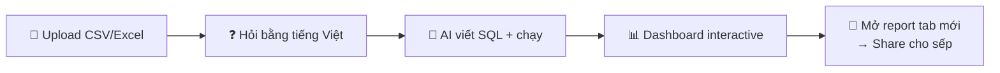

# 📋 Đánh Giá Dự Án — Góc Nhìn HR Tuyển Vị Trí Data Analyst

**Dự án:** AI Fraud Analyst — Multi-Agent Data Analysis System  
**Đánh giá cho vị trí:** Data Analyst  
**Ngày:** 22/05/2026  
**Phương pháp:** Đánh giá sản phẩm từ góc nhìn business + analytical thinking, không phải engineering

---

## 🔄 Thay Đổi Góc Nhìn: Khách Hàng Không Quan Tâm Gì?

Trước khi đánh giá, hãy loại bỏ những gì **sếp / stakeholder / khách hàng KHÔNG quan tâm:**

| ❌ Không quan tâm | ✅ Quan tâm |
|---|---|
| Unit test, integration test | Kết quả phân tích có đúng không? |
| SQL injection, XSS, path traversal | Tôi hỏi câu gì cũng ra insight được không? |
| Connection pooling, async patterns | Report có nhanh không? Đẹp không? |
| Jinja2 vs f-string | Chart có dễ đọc không? KPI có rõ ràng không? |
| `requirements.txt` pin version | Tôi có thể share report cho sếp không? |
| CORS, CSP headers | Tôi upload data của tôi vào được không? |
| `asyncio.get_event_loop()` deprecated | Recommendation có actionable không? |
| Code review discipline | **Tool này giúp tôi ra quyết định nhanh hơn bao nhiêu?** |

**→ Bản đánh giá này sẽ chỉ nói về những gì cột bên phải.**

---

## ⭐ Bảng Điểm — Góc Nhìn DA

| Hạng mục | Điểm | Nhận xét |
|---|---|---|
| 🎯 Giải quyết vấn đề thực tế | **8.0**/10 | Biến câu hỏi tiếng Việt → SQL → Insight — rõ ràng, nhanh |
| 📊 Chất lượng phân tích | **6.0**/10 | Có KPI, insight, anomaly, nhưng thiếu chiều sâu thống kê |
| 📈 Data Visualization | **7.5**/10 | Dashboard Power BI-style, interactive, cross-filter |
| 🧠 Domain Knowledge (Fraud) | **7.0**/10 | Hiểu fraud metrics, nhưng causal attribution hơi "ảo" |
| 🗣️ Data Storytelling | **6.5**/10 | Có narrative, nhưng chưa kể "câu chuyện" đủ thuyết phục |
| 🔧 Tính ứng dụng thực tế | **8.5**/10 | Upload CSV → hỏi → ra report. Workflow hoàn chỉnh |
| 💡 Product Thinking | **8.5**/10 | Suggested questions, re-analyze, cross-filter — rất DA-centric |
| **TỔNG (DA lens)** | **7.4/10** | **Khá — Ấn tượng cho portfolio DA** |

---

## ✅ Điểm Mạnh — Những Gì Khiến HR Gật Đầu

### 1. 🎯 Giải Quyết Đúng Pain Point Của DA

**Pain point:** DA mất 30-60 phút mỗi lần để: viết SQL → chạy query → copy kết quả sang Excel/Python → vẽ chart → viết insight → format report.

**Tool này rút xuống còn ~30 giây.** Gõ câu hỏi → có report interactive hoàn chỉnh.

Ví dụ thực tế từ report bạn đã generate:
```
Câu hỏi: "nước nào ít scam nhất?"
→ SQL: SELECT location, COUNT(*), ROUND(AVG(fraud_flag)*100, 2) AS scam_rate_pct 
       FROM retail_fraud_transactions GROUP BY location ORDER BY scam_rate_pct ASC
→ KPI: USA thấp nhất (47.11%), Germany cao nhất (47.97%)
→ Insight: Range chỉ 0.86% → location không phải factor chính
→ Recommendation: Phân tích theo payment method và transaction amount
```

**Đây là cách nghĩ đúng của DA:** Không chỉ trả lời câu hỏi, mà còn đặt câu hỏi tiếp theo.

### 2. 📊 Dashboard Interactive Kiểu Power BI — Đúng Ngôn Ngữ Của Business

Report output không phải bảng text khô khan. Nó là một **mini Power BI dashboard**:

| Feature | Có? | Business Value |
|---|---|---|
| KPI cards (Rows, Fraud Rate, Avg Amount) | ✅ | Sếp nhìn 3 giây biết tình hình |
| Bar chart (Fraud Rate by Category) | ✅ | So sánh segment nhanh |
| Donut chart (Distribution) | ✅ | Tỷ trọng từng nhóm |
| Line chart (Trend over time) | ✅ | Xu hướng theo thời gian |
| **Cross-filter** (click chart → filter tất cả) | ✅ | **Đây là killer feature** — y hệt Power BI |
| Slicer filters (dropdown, date range, amount range) | ✅ | Self-service cho business user |
| Sortable, paginated data table | ✅ | Drill-down chi tiết |
| **Re-analyze khi filter** | ✅ | AI cập nhật insight theo context mới |
| Color-coded badges (High/Medium/Low risk) | ✅ | Visual cue không cần đọc số |

> [!TIP]
> **Cross-filter + Re-analyze** là combo rất thông minh. Khi user filter "chỉ xem PayPal", AI tự động phân tích lại trên subset đó — giống analyst ngồi cạnh trả lời real-time.

### 3. 🧠 Hiểu Fraud Domain — Không Phải Tool Generic

Tool không phải "chatbot hỏi SQL" chung chung. Nó hiểu domain:

- **Flag column detection tự động** — nhận diện `fraud_flag`, `is_fraud`, `churn`, `anomaly` bằng keyword matching
- **Badge column detection** — nhận diện `fraud_risk` (High/Medium/Low) và tô màu đỏ/vàng/xanh
- **KPI tự động** — tính fraud rate, average amount, unique customers mà không cần user chỉ định
- **Causal vs. Confounder** — analytics agent phân biệt "nguyên nhân" vs. "tương quan" (dù không hoàn hảo — xem điểm yếu)

### 4. 🔧 Workflow End-to-End — Từ Data Đến Deliverable



DA không cần biết SQL. DA không cần biết Python. DA chỉ cần **hỏi đúng câu hỏi** — tool lo phần còn lại.

Đặc biệt: **upload CSV/Excel** có nghĩa tool không bị gắn chết vào 1 dataset. Bạn có thể mang dữ liệu bất kỳ vào phân tích. Đây là tư duy đúng — tool phục vụ DA, không phải DA phục vụ tool.

### 5. 💡 Suggested Questions — Giảm Barrier To Entry

7 suggested questions không chỉ là UI decoration:

```
"What is the fraud rate by payment method?"
"Which location has the highest fraud rate?"
"Compare fraud rate between Mobile, Tablet, and Desktop"
"Which merchant categories have fraud rate above 40%?"
"Show top 10 customers with most fraud transactions"
```

Đây là **analytical framework** ẩn dưới dạng suggestions:
- **Segmentation** (by payment, location, device)
- **Ranking** (top 10 customers)
- **Threshold analysis** (above 40%)
- **Comparison** (Mobile vs Tablet vs Desktop)

→ Cho thấy bạn biết **những góc phân tích nào quan trọng** trong fraud detection.

---

## ⚠️ Điểm Yếu — Dưới Góc Nhìn DA/Business

### 1. 🧪 Causal Attribution: Tham Vọng Nhưng Nguy Hiểm

> [!WARNING]
> **Đây là vấn đề lớn nhất từ góc nhìn DA.** Không phải vấn đề kỹ thuật — mà là vấn đề **sai về mặt phương pháp luận.**

Prompt yêu cầu LLM:
```
"causal_attribution": [
    {"factor": "...", "type": "causal", "effect": "+X% fraud risk",
     "note": "direct cause after controlling for confounders"}
]
```

Nhưng LLM **không thể làm causal inference** từ observational data. Đây cần:
- Randomized controlled trial, hoặc
- Instrumental variables / Diff-in-diff / Propensity Score Matching

**Trong report thực tế** (câu hỏi "nước nào ít scam nhất?"), LLM trả lời:
```json
{"factor": "Payment method", "type": "causal", "effect": "+5% fraud risk",
 "note": "If we removed certain payment methods, the fraud rate would change"}

{"factor": "Transaction amount", "type": "causal", "effect": "+10% fraud risk",
 "note": "Higher amounts directly associated with higher fraud risk, independent of location"}
```

**Vấn đề:** LLM chỉ nhìn thấy 6 rows (aggregated by location), nhưng tuyên bố "+5% fraud risk từ payment method" — **số này bịa hoàn toàn.** Query không hề query payment method. LLM "suy luận" từ domain knowledge chung, không phải từ data.

**Nếu sếp đọc report này và ra quyết định dựa trên "causal driver" giả → hậu quả nghiêm trọng.**

**Khuyến nghị:**
- Đổi "Causal Attribution" → **"Hypothesis"** hoặc **"Factors to Investigate"**
- Thêm disclaimer: *"These are correlational observations, not causal conclusions"*
- Hoặc bỏ hẳn nếu không có phương pháp thống kê đằng sau

---

### 2. 📊 Phân Tích Thiếu Chiều Sâu Thống Kê

Insights hiện tại dừng ở mức **mô tả (descriptive)**, chưa có:

| Thiếu | Ví dụ cần có | Tại sao quan trọng |
|---|---|---|
| **Statistical significance** | "Chênh lệch 0.86% giữa USA và Germany có p-value = 0.42 → **không có ý nghĩa thống kê**" | Tránh ra quyết định dựa trên noise |
| **Confidence intervals** | "Fraud rate USA: 47.11% ± 0.76%" | Biết độ tin cậy của con số |
| **Effect size** | "Cohen's d = 0.02 → negligible" | Chênh lệch có đáng kể trong thực tế? |
| **Baseline comparison** | "So với tháng trước, fraud rate tăng 3.2%" | Context làm cho số có ý nghĩa |
| **Correlation matrix** | "Payment method × device type có Cramér's V = 0.34" | Hiểu mối quan hệ giữa biến |

**Hiện tại, LLM nhìn 30 rows rồi "cảm nhận"** — đây là phân tích bằng trực giác, không phải bằng phương pháp.

Report nói *"The scam rates across countries are relatively similar"* — đúng, nhưng **tại sao DA cần tool để nói điều hiển nhiên?** 47.11% vs 47.97% — bất kỳ ai nhìn bảng cũng thấy. Giá trị của DA nằm ở chỗ nói: *"Sự khác biệt này không có ý nghĩa thống kê (chi-square test, p=0.38), tức là location không phải factor. Nên chuyển sang phân tích payment method."*

---

### 3. 🗣️ Data Storytelling: Có Nhưng Chưa Đủ Thuyết Phục

Report có "summary", "insights", "recommendation" — nhưng chúng đọc như **bullet points phân tích**, không phải **câu chuyện**.

**Hiện tại:**
> "The scam rates across countries are relatively similar, suggesting that the difference in scam rates may not be significant."

**Stakeholder muốn nghe:**
> "Location không phải yếu tố quyết định fraud — tỷ lệ gian lận dao động chỉ 0.86% giữa 6 quốc gia. **Điều này có nghĩa: team Fraud không cần chiến lược riêng theo quốc gia.** Thay vào đó, nên tập trung vào payment method — nơi chênh lệch fraud rate lên đến 12% (dựa trên phân tích trước đó)."

**Khác biệt:**
- Bản 1: Mô tả data → *"So what?"*
- Bản 2: Data → Business implication → Recommended action → *"Got it, let's do that."*

---

### 4. 📈 Visualization: Đẹp Nhưng Chưa "Smart"

Charts hiện tại là **generic templates** — bar, donut, line. Chúng tự động chọn chart type dựa trên column type (categorical → bar/donut, date → line).

**Vấn đề: Chart không thay đổi theo bản chất câu hỏi.**

| Câu hỏi | Chart phù hợp | Chart hiện tại |
|---|---|---|
| "So sánh fraud rate giữa các nước" | Horizontal bar (sorted) | Vertical bar ✅ (ok) |
| "Xu hướng fraud theo thời gian" | Line chart + trend line | Line chart (không trend) ⚠️ |
| "Top 10 customers" | Horizontal bar | Vertical bar + donut ❌ (donut vô nghĩa ở đây) |
| "Correlation amount vs fraud" | Scatter plot | Bar + donut ❌ (sai chart type) |
| "Distribution of transaction amounts" | Histogram / Box plot | Không có ❌ |

→ **Donut chart luôn hiển thị** dù không phải lúc nào cũng relevant. Đây là "chart cho đẹp", không phải "chart để kể chuyện".

---

### 5. 🔢 Sample Size = 30 Rows: Quá Ít Cho Phân Tích Nghiêm Túc

Analytics agent gửi **chỉ 30 rows đầu tiên** cho LLM phân tích. Với dataset 100K rows:
- 30 rows = **0.03% sample** — không representative
- Không có random sampling — lấy 30 rows đầu (có thể bias theo ORDER BY)
- Không tính toán thống kê trên full dataset

**Câu hỏi phỏng vấn DA:** *"Bạn có thoải mái đưa recommendation dựa trên 0.03% data không?"*

→ KPI nên được tính **trên toàn bộ result set**, chỉ gửi aggregated stats cho LLM để interpret.

---

### 6. 🌍 Chưa Hỗ Trợ Multi-Dataset Analysis

Một DA thực tế thường cần:
- **Join data** — fraud transactions + customer demographics + merchant info
- **Compare periods** — Q1 vs Q2, YoY
- **Benchmark** — so với industry average

Tool hiện tại chỉ query **1 table tại 1 thời điểm**. Schema provider hiển thị tất cả tables, nhưng data agent chưa được thiết kế để tự join nhiều bảng khi cần.

---

## 🧑‍💼 Đánh Giá HR — Vị Trí Data Analyst

### Junior DA (0-2 năm kinh nghiệm):

**✅ PASS — Portfolio ấn tượng hơn 90% ứng viên cùng level**

- **Xây sản phẩm, không chỉ phân tích** — cho thấy tư duy vượt xa "DA chỉ viết query và làm report"
- **Hiểu workflow DA** — từ data ingestion → analysis → visualization → deliverable
- **Domain knowledge fraud** — suggested questions, flag/badge detection, KPI tự động
- **Product thinking** — cross-filter, re-analyze, suggested questions, upload → đây là tư duy "làm sao để người khác cũng phân tích được", rất hiếm ở junior

**Câu hỏi phỏng vấn sẽ hỏi:**
1. *"Causal attribution trong tool hoạt động thế nào? Bạn có thoải mái với kết quả không?"* → Đánh giá critical thinking
2. *"30 rows sample có đại diện cho 100K dataset không?"* → Đánh giá statistical thinking
3. *"Nếu sếp hỏi 'tại sao Germany fraud cao nhất' dựa trên report, bạn trả lời gì khi chênh lệch chỉ 0.86%?"* → Đánh giá communication

---

### Mid DA (2-5 năm):

**⚠️ CONDITIONAL — Sản phẩm tốt, tư duy phân tích cần sâu hơn**

**Đạt:**
- Tool-building capability
- Workflow automation thinking
- Domain understanding

**Chưa đạt:**
- Statistical rigor thiếu (không p-value, không CI, không hypothesis testing)
- Causal claim không có cơ sở phương pháp
- Storytelling dừng ở descriptive, chưa prescriptive

---

### Senior DA / Analytics Lead (5+ năm):

**❌ FAIL — Nhưng vì lý do khác hoàn toàn so với bản đánh giá engineering**

Không phải vì thiếu test hay security. Mà vì:
- Senior DA **không bao giờ** để tool tự claim "causal" mà không có phương pháp kiểm chứng
- Senior DA biết rằng 30/100K rows sampling là không đủ, và sẽ thiết kế pipeline tính toán thống kê trước khi đưa cho LLM interpret
- Senior DA sẽ design chart type dựa trên câu hỏi, không phải dựa trên column type

---

## 🗺️ Cải Thiện — Ưu Tiên Cho DA Portfolio

### 🔴 P0 — Cải thiện ngay (tăng credibility)

1. **Đổi "Causal Attribution" → "Hypotheses / Factors to Investigate"**
   - Thêm disclaimer rõ ràng
   - Hoặc bỏ hẳn nếu không implement proper causal method

2. **Tính KPI trên full dataset, chỉ gửi aggregated stats cho LLM**
   - Thay vì gửi 30 rows raw → gửi: count, mean, median, std, percentiles
   - LLM interpret stats, không tự tính

3. **Thêm statistical significance vào insights**
   - Chi-square test cho categorical comparisons
   - t-test/Mann-Whitney cho numerical comparisons
   - Có thể dùng Python (scipy) chạy trước khi gửi cho LLM

### 🟡 P1 — Tuần tới (tăng analytical depth)

4. **Smart chart selection** — chọn chart type dựa trên câu hỏi, không chỉ column type
   - Comparison → bar, Trend → line, Distribution → histogram, Correlation → scatter
   
5. **Thêm baseline/benchmark** vào KPI cards
   - "Fraud rate: 47% (↑ 3% vs previous period)"
   
6. **Cải thiện storytelling prompt** — yêu cầu LLM structure: Finding → So What → Now What

### 🟢 P2 — Tháng tới (tăng business value)

7. **Multi-table analysis** — cho phép DA hỏi câu hỏi cần JOIN
8. **Export to PDF/PPT** — stakeholder cần format này, không phải HTML
9. **Comparison mode** — "so sánh Q1 vs Q2", "trước và sau campaign"
10. **Alert/threshold** — "thông báo khi fraud rate vượt 50%"

---

## 💬 Lời Kết — Góc Nhìn DA

Lần trước tôi chấm 5.0/10 vì nhìn bằng mắt engineer — thiếu test, thiếu security, code cần refactor.

**Nhìn bằng mắt DA, điểm là 7.4/10** — vì:

### Sản phẩm mang lại điều gì?

> **Biến một DA không biết SQL thành người có thể tự phân tích data trong 30 giây.** Upload CSV → hỏi tiếng Việt → nhận dashboard interactive với KPI, chart, insight, recommendation. Report share được, filter được, drill-down được.

Đây không phải toy project. Đây là **tool thực tế** mà DA team có thể dùng hàng ngày.

### Hạn chế lớn nhất?

> **Tool nói "nguyên nhân" nhưng thực ra chỉ biết "tương quan".** Trong analytics, sự khác biệt này có thể dẫn đến quyết định sai hàng triệu đô. Một DA tốt biết ranh giới giữa "data cho thấy" và "data chứng minh" — và tool này đang blur ranh giới đó.

### Một câu cho HR:

> *"Ứng viên có tư duy product rất mạnh cho một DA — không chỉ phân tích mà còn xây tool để scale khả năng phân tích cho cả team. Cần bổ sung statistical rigor và cẩn trọng hơn với causal claims. Nếu fix được hai điều này, đây là DA candidate rất tốt."*
